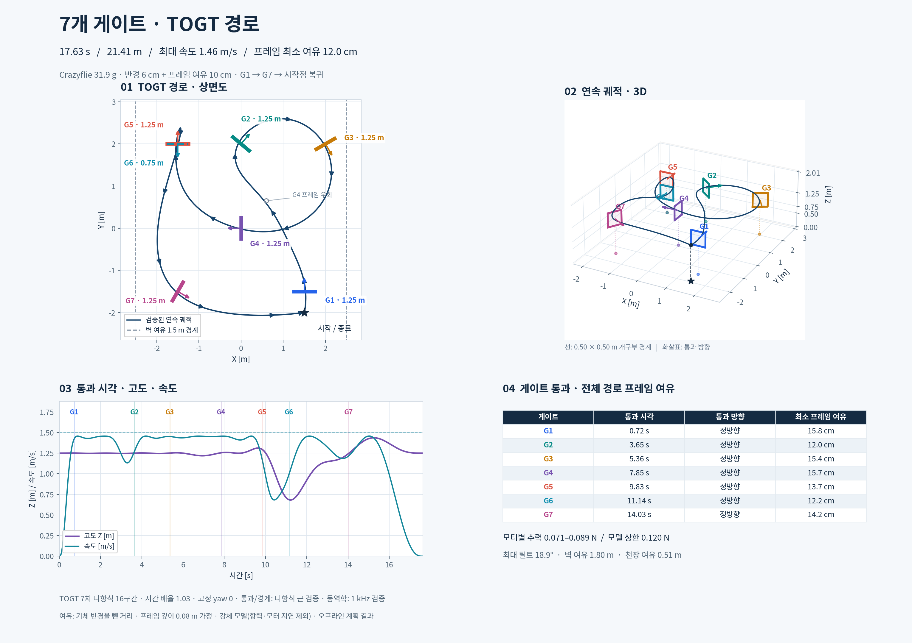
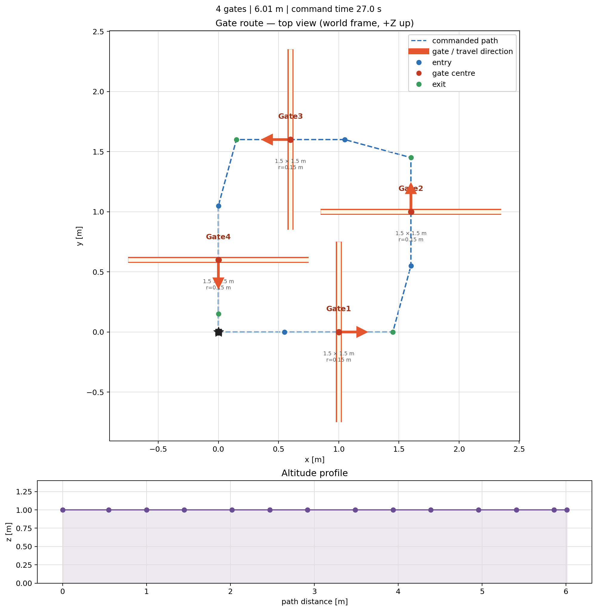

# Crazyflie Gate Route

실측 배치의 **7게이트 TOGT 경로**를 추가했습니다: [결과·기체 사양·검증·재현 방법](docs/TOGT_SEVEN_GATES.md). 약 21.41 m / 17.63초, Crazyflie 31.9 g 모델과 반경 0.06 m·프레임 여유 0.10 m를 적용했습니다. 아래 4게이트 예제는 초기 기능 설명용입니다.



Crazyflie 실험용 게이트 통과 경로를 YAML에서 생성·검증·시각화하는 작은 독립 도구입니다. 각 게이트를 **진입점 → 게이트 중심 → 이탈점**으로 확장합니다. 출력은 컨트롤러 중립적이므로 Crazyswarm `goTo`, MAVLink setpoint, 또는 별도 궤적 최적화기로 연결할 수 있습니다.



## 포함 내용

- `config/demo_gate_route.yaml` — 4개 게이트, 1 m 고도의 예시 폐회로
- `gate_route.py` — YAML 검증 및 waypoint/구간 시간 생성
- `scripts/plot_route.py` — 상면도와 고도 프로파일 PNG 생성
- `tests/` — 예시 경로 구조·최소 구간 시간 검증

## 필요한 사양

참조 규격은 VADR-TS-002 Issue 00.02입니다.

| 항목 | 값 |
| --- | --- |
| 가상 드론 외형 | 0.28 × 0.28 × 0.16 m |
| 게이트 내부 개구부 | 1.50 × 1.50 m |
| 게이트 깊이 | 0.26 m |
| 물리 시뮬레이션 | 120 Hz |
| MAVLink 명령률 | 100 Hz 미만 |
| 카메라 | 640 × 360, 30 Hz |
| 규격 좌표계 | MAVLink NED |
| 이 저장소 경로 좌표계 | 측정된 Crazyswarm/Qualisys `world_z_up` |

VADR 규격에는 실제 코스의 게이트 좌표·방향이 포함돼 있지 않습니다. 따라서 예시 YAML은 공식 코스가 아니며, 실제 비행 전에는 `center`, `yaw_deg`, 개구부 치수를 측정값으로 교체해야 합니다.

`safety_radius_m: 0.15`는 예시의 보수적 계획 여유입니다. VADR 기체 치수나 실제 Crazyflie 외형을 자동으로 의미하지 않으므로, 프로펠러·가드·위치추정 오차를 포함해 현장 위험평가로 정해야 합니다.

## 실행

```bash
git clone <YOUR_GITHUB_REPOSITORY_URL>
cd crazyflie-gate-route
python3 -m venv .venv
. .venv/bin/activate
pip install -r requirements.txt

# 경로/구간 시간 출력
python3 gate_route.py config/demo_gate_route.yaml

# JSON 출력
python3 gate_route.py config/demo_gate_route.yaml --json

# 시각화 다시 만들기
MPLCONFIGDIR=/tmp/matplotlib python3 scripts/plot_route.py

# 검증 (외부 테스트 패키지 불필요)
python3 -m unittest discover -s tests
```

## 경로 형식

게이트의 통과 방향은 `yaw_deg`로 정의합니다. 법선은 `[cos(yaw), sin(yaw), 0]`이고, `approach_distance_m`만큼 법선 반대편에 진입점, `exit_distance_m`만큼 정방향에 이탈점을 둡니다.

```yaml
gates:
  - id: Gate1
    center: [1.0, 0.0, 1.0]
    yaw_deg: 0.0
    inner_width_m: 1.5
    inner_height_m: 1.5
```

`inner_width_m`과 `inner_height_m`은 각각 `2 × safety_radius_m`보다 커야 하며, YAML 검증은 그렇지 않은 경로를 거부합니다. 이 검증은 정적 기하 여유만 확인합니다. 장애물, 실제 문틀 오차, 배터리, 통신, 비상 정지 절차는 별도로 검증해야 합니다.

## Crazyswarm/MAVLink 연결 시 주의

이 저장소는 안전을 위해 비행 명령을 직접 송신하지 않습니다. 생성한 `points`를 사용하려면 다음을 별도로 구현·검증해야 합니다.

- Crazyswarm: 각 지점에 `cf.goTo(position, yaw, duration)` 전송
- MAVLink: `world_z_up`을 `LOCAL_NED`로 올바르게 변환해 setpoint 전송
- 실제 기체: 한 개 게이트부터 모션캡처 기반 저속 비행으로 확인
